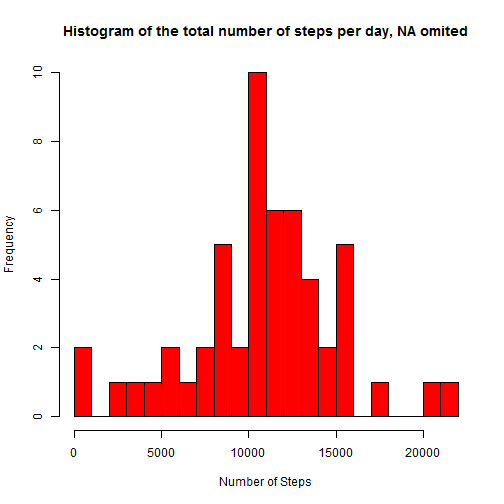
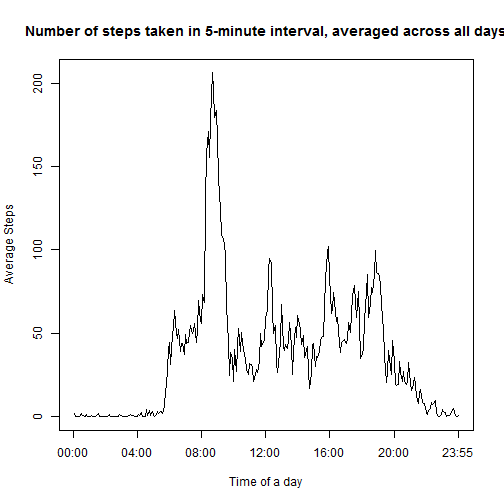
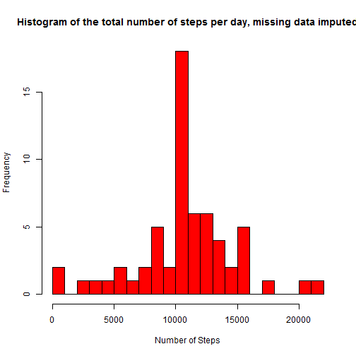
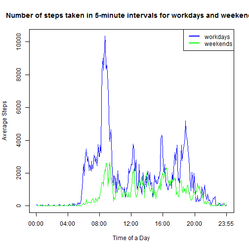

Reproducible Research: Peer Assessment 1
=======================================================================================================
##Report on personal activity patterns

*Georgy Ulukhanov*

*January 7, 2015*

###Introduction
It is now possible to collect a large amount of data about personal movement using activity monitoring devices such as a Fitbit, Nike Fuelband, or Jawbone Up. These type of devices are part of the “quantified self” movement - a group of enthusiasts who take measurements about themselves regularly to improve their health, to find patterns in their behavior, or because they are tech geeks. But these data remain under-utilized both because the raw data are hard to obtain and there is a lack of statistical methods and software for processing and interpreting the data.

This report makes use of data from a personal activity monitoring device. This device collects data at 5 minute intervals through out the day. The data consists of two months of data from an anonymous individual collected during the months of October and November, 2012 and include the number of steps taken in 5 minute intervals each day.

###Data
The data for this assignment can be downloaded from the course web site:

Dataset: [Activity monitoring data] (https://d396qusza40orc.cloudfront.net/repdata%2Fdata%2Factivity.zip) [52K]
The variables included in this dataset are:

steps: Number of steps taking in a 5-minute interval (missing values are coded as NA)

date: The date on which the measurement was taken in YYYY-MM-DD format

interval: Identifier for the 5-minute interval in which measurement was taken

The dataset is stored in a comma-separated-value (CSV) file and there are a total of 17,568 observations in this dataset.

###Tasks to perform
**1. Loading and preprocessing the data**

Show any code that is needed to

1.Load the data (i.e. read.csv())

2.Process/transform the data (if necessary) into a format suitable for your analysis

**2. What is mean total number of steps taken per day?**

For this part of the assignment, you can ignore the missing values in the dataset.

1. Make a histogram of the total number of steps taken each day

2. Calculate and report the mean and median total number of steps taken per day

**3. What is the average daily activity pattern?**

1. Make a time series plot (i.e. type = "l") of the 5-minute interval (x-axis) and the average number of steps taken, averaged across all days (y-axis)

2. Which 5-minute interval, on average across all the days in the dataset, contains the maximum number of steps?

**4. Imputing missing values**

Note that there are a number of days/intervals where there are missing values (coded as NA). The presence of missing days may introduce bias into some calculations or summaries of the data.

1. Calculate and report the total number of missing values in the dataset (i.e. the total number of rows with NAs)

2. Devise a strategy for filling in all of the missing values in the dataset. The strategy does not need to be sophisticated. For example, you could use the mean/median for that day, or the mean for that 5-minute interval, etc.

3. Create a new dataset that is equal to the original dataset but with the missing data filled in.

4. Make a histogram of the total number of steps taken each day and Calculate and report the mean and median total number of steps taken per day. Do these values differ from the estimates from the first part of the assignment? What is the impact of imputing missing data on the estimates of the total daily number of steps?

**5. Are there differences in activity patterns between weekdays and weekends?**

For this part the weekdays() function may be of some help here. Use the dataset with the filled-in missing values for this part.

1. Create a new factor variable in the dataset with two levels – “weekday” and “weekend” indicating whether a given date is a weekday or weekend day.

2. Make a panel plot containing a time series plot (i.e. type = "l") of the 5-minute interval (x-axis) and the average number of steps taken, averaged across all weekday days or weekend days (y-axis). See the README file in the GitHub repository to see an example of what this plot should look like using simulated data.


##1. Loading and preprocessing the data

###1.1 Download, read and inspect data
note: 
1. Repository is cloned to the working directory by "git clone" command
2. working directory is set in RStudio

```r
#unzip and read file into R
unzip("activity.zip")
data <- read.csv("activity.csv")

#inspect data
summary(data)
```

```
##      steps                date          interval     
##  Min.   :  0.00   2012-10-01:  288   Min.   :   0.0  
##  1st Qu.:  0.00   2012-10-02:  288   1st Qu.: 588.8  
##  Median :  0.00   2012-10-03:  288   Median :1177.5  
##  Mean   : 37.38   2012-10-04:  288   Mean   :1177.5  
##  3rd Qu.: 12.00   2012-10-05:  288   3rd Qu.:1766.2  
##  Max.   :806.00   2012-10-06:  288   Max.   :2355.0  
##  NA's   :2304     (Other)   :15840
```

```r
str(data)
```

```
## 'data.frame':	17568 obs. of  3 variables:
##  $ steps   : int  NA NA NA NA NA NA NA NA NA NA ...
##  $ date    : Factor w/ 61 levels "2012-10-01","2012-10-02",..: 1 1 1 1 1 1 1 1 1 1 ...
##  $ interval: int  0 5 10 15 20 25 30 35 40 45 ...
```
###1.2 Preprocess data
convert the “date” variable to a Date class and the “interval” variable to a Factor class

```r
data$date <- as.Date(data$date, format = "%Y-%m-%d")
data$interval <- factor(data$interval)
str(data)
```

```
## 'data.frame':	17568 obs. of  3 variables:
##  $ steps   : int  NA NA NA NA NA NA NA NA NA NA ...
##  $ date    : Date, format: "2012-10-01" "2012-10-01" ...
##  $ interval: Factor w/ 288 levels "0","5","10","15",..: 1 2 3 4 5 6 7 8 9 10 ...
```
## 2. What is mean total number of steps taken per day?

###2.1 Make a histogram of the total number of steps taken each day


```r
#create dataset with total steps per day, NA rows omited
stepsperday <- aggregate(steps~date, data, sum, na.rm=T)
colnames(stepsperday) <- c("date", "steps")
str(stepsperday)
```

```
## 'data.frame':	53 obs. of  2 variables:
##  $ date : Date, format: "2012-10-02" "2012-10-03" ...
##  $ steps: int  126 11352 12116 13294 15420 11015 12811 9900 10304 17382 ...
```

```r
#create histogram
hist(stepsperday$steps, breaks=20,col = "red", xlab = "Number of Steps", main= "Histogram of the total number of steps per day, NA omited")
```

 


### 2.2  Calculate and report the mean and median total number of steps taken per day


```r
#Mean
mean(stepsperday$steps)
```

```
## [1] 10766.19
```

```r
#Median
median(stepsperday$steps)
```

```
## [1] 10765
```
##3. What is the average daily activity pattern?

### 3.1 Make a time series plot (i.e. type = "l") of the 5-minute interval (x-axis) and the average number of steps taken, averaged across all days (y-axis)


```r
#Calculate means for each interval, NA omited, and assign to new dataset
avgstepsperinterval <- aggregate(steps~interval, data, mean, na.rm=T)
colnames(avgstepsperinterval) <- c("interval", "avg_steps")
str(avgstepsperinterval)
```

```
## 'data.frame':	288 obs. of  2 variables:
##  $ interval : Factor w/ 288 levels "0","5","10","15",..: 1 2 3 4 5 6 7 8 9 10 ...
##  $ avg_steps: num  1.717 0.3396 0.1321 0.1509 0.0755 ...
```

```r
#Create plot
plot(c(1:288), avgstepsperinterval$avg_steps,  
     type="l", 
     main="Number of steps taken in 5-minute interval, averaged across all days", 
     xlab="Time of a day",
     ylab="Average Steps",
     xaxt = "n")
#Create labels for x axis
axis(side = 1, at=c(0,48,96,144,192,240, 288), labels=c("00:00","04:00","08:00","12:00","16:00","20:00","23:55"))
```

 


### 3.2  Which 5-minute interval, on average across all the days in the dataset, contains the maximum number of steps?


```r
with(avgstepsperinterval,avgstepsperinterval[avg_steps == max(avg_steps),])
```

```
##     interval avg_steps
## 104      835  206.1698
```
Answer: Interval "8:35"

##4. Imputing missing values

### 4.1 Calculate and report the total number of missing values in the dataset (i.e. the total number of rows with NAs)


```r
length(data$steps[is.na(data$steps)])
```

```
## [1] 2304
```
### 4.2 Devise a strategy for filling in all of the missing values in the dataset. The strategy does not need to be sophisticated. For example, you could use the mean/median for that day, or the mean for that 5-minute interval, etc.

– Strategy: Missing values in the steps column will be filled in with the mean for that 5-minute interval across all days

### 4.3 Create a new dataset that is equal to the original dataset but with the missing data filled in.


```r
#Create NA index logical vector
NA_index <- is.na(data$steps)
#Create new data set
newdata <- data
newdata$steps[is.na(newdata$steps)] <- avgstepsperinterval$avg_steps[NA_index=T]
str(newdata)
```

```
## 'data.frame':	17568 obs. of  3 variables:
##  $ steps   : num  1.717 0.3396 0.1321 0.1509 0.0755 ...
##  $ date    : Date, format: "2012-10-01" "2012-10-01" ...
##  $ interval: Factor w/ 288 levels "0","5","10","15",..: 1 2 3 4 5 6 7 8 9 10 ...
```
###4.4 Make a histogram of the total number of steps taken each day and Calculate and report the mean and median total number of steps taken per day. Do these values differ from the estimates from the first part of the assignment? What is the impact of imputing missing data on the estimates of the total daily number of steps?


```r
#Create new total steps per day data set with inmputed Na data
stepsperdaycomp <- aggregate(steps~date, newdata, sum)
colnames(stepsperdaycomp) <- c("date", "steps")
#Create histogram
hist(stepsperdaycomp$steps, breaks=20,col = "red", xlab = "Number of Steps", main= "Histogram of the total number of steps per day, missing data imputed")
```

 

```r
#Mean
mean(stepsperdaycomp$steps)
```

```
## [1] 10766.19
```

```r
#Median
median(stepsperdaycomp$steps)
```

```
## [1] 10766.19
```

```r
#Change in %:
        #for means
(mean(stepsperdaycomp$steps)-mean(stepsperday$steps))/mean(stepsperday$steps)*100
```

```
## [1] 0
```

```r
        #for medians
(median(stepsperdaycomp$steps)-median(stepsperday$steps))/median(stepsperday$steps)*100
```

```
## [1] 0.01104207
```
-Answer: Change for means is 0%, for medians is 0.01% - very unsignificant. The histograms differ only in the bar of maximal frequency

##5. Are there differences in activity patterns between weekdays and weekends?

### 5.1 Create a new factor variable in the dataset with two levels – “weekday” and “weekend” indicating whether a given date is a weekday or weekend day.


```r
#Set time setting to "english"" - in sense to get weekdays in english
Sys.setlocale("LC_TIME", "English")
```

```
## [1] "English_United States.1252"
```

```r
#Create new column with Factor variable "dow" (day of week)
newdata$dow <- as.factor(weekdays(newdata$date))
str(newdata)
```

```
## 'data.frame':	17568 obs. of  4 variables:
##  $ steps   : num  1.717 0.3396 0.1321 0.1509 0.0755 ...
##  $ date    : Date, format: "2012-10-01" "2012-10-01" ...
##  $ interval: Factor w/ 288 levels "0","5","10","15",..: 1 2 3 4 5 6 7 8 9 10 ...
##  $ dow     : Factor w/ 7 levels "Friday","Monday",..: 2 2 2 2 2 2 2 2 2 2 ...
```

```r
#Create subsets for weekdays and weekend
newdata_weekend <- newdata[which(newdata$dow == "Saturday" | newdata$dow == "Sunday"),]
str(newdata_weekend)
```

```
## 'data.frame':	4608 obs. of  4 variables:
##  $ steps   : num  0 0 0 0 0 0 0 0 0 0 ...
##  $ date    : Date, format: "2012-10-06" "2012-10-06" ...
##  $ interval: Factor w/ 288 levels "0","5","10","15",..: 1 2 3 4 5 6 7 8 9 10 ...
##  $ dow     : Factor w/ 7 levels "Friday","Monday",..: 3 3 3 3 3 3 3 3 3 3 ...
```

```r
newdata_wkdays <- newdata[which(newdata$dow != "Saturday" & newdata$dow != "Sunday"),]
str(newdata_wkdays)                                                  
```

```
## 'data.frame':	12960 obs. of  4 variables:
##  $ steps   : num  1.717 0.3396 0.1321 0.1509 0.0755 ...
##  $ date    : Date, format: "2012-10-01" "2012-10-01" ...
##  $ interval: Factor w/ 288 levels "0","5","10","15",..: 1 2 3 4 5 6 7 8 9 10 ...
##  $ dow     : Factor w/ 7 levels "Friday","Monday",..: 2 2 2 2 2 2 2 2 2 2 ...
```
### 5.2 Make a panel plot containing a time series plot (i.e. type = "l") of the 5-minute interval (x-axis) and the average number of steps taken, averaged across all weekday days or weekend days (y-axis). See the README file in the GitHub repository to see an example of what this plot should look like using simulated data.


```r
#Create data
steps_weekend <- aggregate(steps~interval, data=newdata_weekend, sum)
colnames(steps_weekend) <- c("interval", "avg_steps")
str(steps_weekend)
```

```
## 'data.frame':	288 obs. of  2 variables:
##  $ interval : Factor w/ 288 levels "0","5","10","15",..: 1 2 3 4 5 6 7 8 9 10 ...
##  $ avg_steps: num  3.434 0.679 0.264 0.302 0.151 ...
```

```r
steps_wkdays <- aggregate (steps~interval, data=newdata_wkdays, sum)
colnames(steps_wkdays) <- c("interval", "avg_steps")
str(steps_wkdays)
```

```
## 'data.frame':	288 obs. of  2 variables:
##  $ interval : Factor w/ 288 levels "0","5","10","15",..: 1 2 3 4 5 6 7 8 9 10 ...
##  $ avg_steps: num  101.3 20.04 7.79 8.91 4.45 ...
```

```r
#Create plot1
plot(x=c(1:288), y=steps_wkdays$avg_steps,  
     type="l", 
     col="blue",
     main="Number of steps taken in 5-minute intervals for workdays and weekends",
     xlab="Time of a Day",
     ylab="Average Steps",
     xaxt = "n")

#Create plot2 on the same plot
lines(c(1:288), steps_weekend$avg_steps,  
     type="l", 
     col="green",
     xaxt = "n")

#Create labels for x axis
axis(side = 1, at=c(0,48,96,144,192,240, 288), labels=c("00:00","04:00","08:00","12:00","16:00","20:00","23:55"))

#Create legend
legend("topright", legend=c("workdays","weekends"), lty=c(1,1), lwd=c(2,2), col=c("blue","green"))
```

 


Answer: as seen from the plot, activities in workdays and weekdays differ greatly
